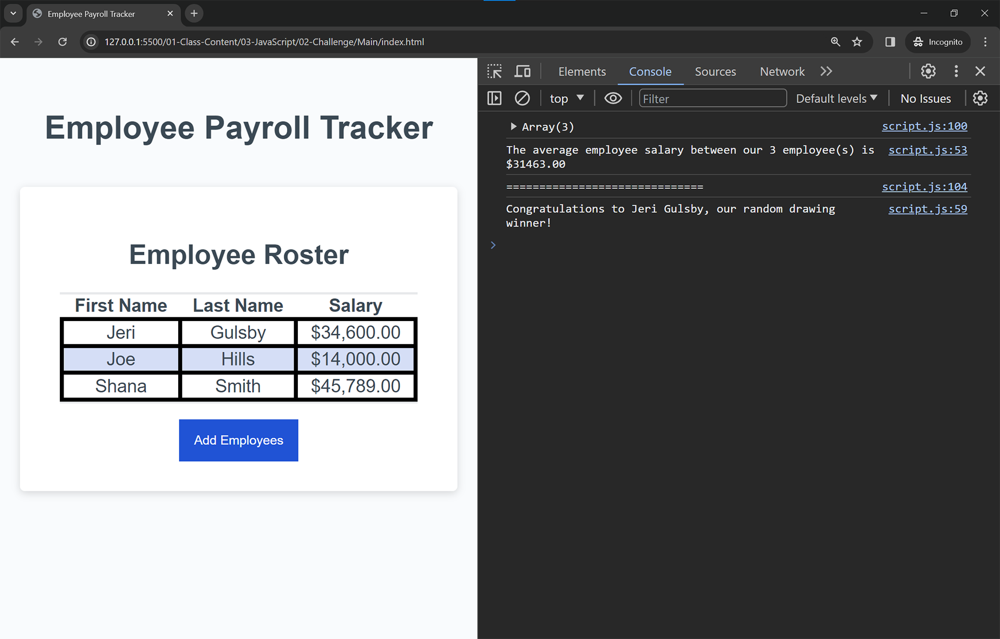

# Employee Payroll Tracker

## Mock-Up

The following images show the web application's appearance and functionality:

## What I have done
#### Filled out the following three functions:

* `collectEmployees`: This function will allow a user to add multiple employees to display on the page.  The user will need to enter the first name, last name, and salary of each employee, then have the option to keep adding employees until they choose to stop. 
If employee information input is left blank, a reminder message will display.

* `displayAverageSalary`: This function will take in the generated array of employees and log the average salary and number of employees to the console.  You should use a template literal string for this task.

* `getRandomEmployee`: This function will take in the generated array of employees, randomly select one employee, and use a template literal to log their full name to the console.  

#### The provided starter code includes the following two functions:

* `displayEmployees`: This function will take in an array of employees and render each employee to an HTML table.

* `trackEmployeeData`: This function will execute when the "Add Employees" button is clicked. It will take the array generated in your `collectEmployees` function, sort the employees by last name, and place them on a table on the page using the provided `displayEmployees` function.  Additionally, the function will execute the `displayAverageSalary` function to log the average employee salary to the console, and execute the `getRandomEmployee` function to log a random employees information to the console.

## File location
CSS code is located in assets -> CSS folder

JavaScript code is located in asset -> Js folder

## Deploy
The URL of the deployed application: https://saraz-git.github.io/develop-payroll-tracker/

The URL of the GitHub repository: https://github.com/Saraz-Git/develop-payroll-tracker
